<div align="center">



<a href="https://github.com/KongA510">
  
</a>
<a href="mailto:891907643@qq.com">
  
</a>


</div>


## 👨‍💻 关于我 · ABOUT

```csharp
public sealed class KongA : IDotNetDeveloper
{
    public string Name     => "Kong.A";
    public string Role     => ".NET Desktop Developer";
    public string Location => "China · UTC+8";

    public string[] CoreStack => ["C#", ".NET", "WPF", "EF Core", "SQL Server"];
    public string CurrentFocus => "Aras Innovator 工具链 · PLM 二次开发";
    public string Motto => "把复杂需求，写成优雅的代码。";

    public bool OpenToCollaborate => true;
}
```

- 🔭 正在开发：**ArasToolkit** — 一套 Aras Innovator 开发工具箱（WPF + EF Core + MVVM）
- 🌱 深耕方向：**.NET 桌面端 / PLM 系统集成 / 企业级效率工具**
- ⚡ 开发哲学：高内聚低耦合 · 接口驱动 · 简洁即力量


## 🚀 技术栈 · TECH STACK

**语言 / LANGUAGES**


**框架 / FRAMEWORKS**


**数据 / DATA**


**工具 / TOOLS**


## 📊 数据 · GITHUB STATS

<div align="center">


<br/>


</div>


## 📫 联系 · CONTACT

<div align="center">

**合作 / 交流 / 拍砖，欢迎随时找我：**

<a href="mailto:891907643@qq.com">
  
</a>
<a href="https://github.com/KongA510">
  
</a>

</div>

<br/>

<div align="center">

<sub>© 2026 KONG.A · POWERED BY C# & ☕ · 本页 Banner 为手绘动画 SVG</sub>

</div>
